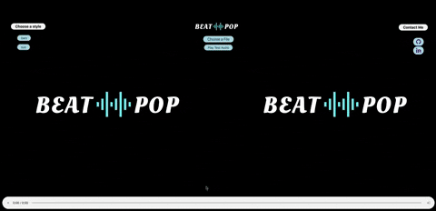

# BeatPop

## [Take a look at BeatPop live](https://sanaanymoe.github.io/)
## Contents
* Introduction. 
* Technologies.
* Features

## Introduction

BeatPop is an application that takes in the changes in the music's loudness and frequency spectrum to generate animated shapes. Those shapes are generated and rendered in real time and in a way synchronized with the music as it is played. 

## Technologies

* Javascript.
* Web Audio API.
* Hosted on [github](https://sanaanymoe.github.io/)

## features

* User can play a sample audio(for test purpose)

