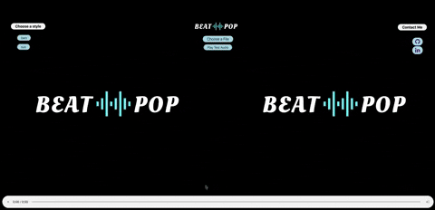
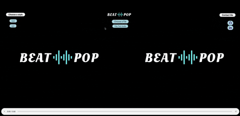
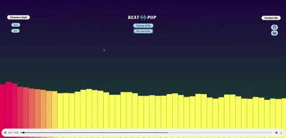

# BeatPop

## [Take a look at BeatPop live](https://sanaanymoe.github.io/BeatPop/)
## Contents
* [Introduction](https://github.com/sanaanymoe/BeatPop#introduction). 
* [Technologies](https://github.com/sanaanymoe/BeatPop#technologies).
* [Features](https://github.com/sanaanymoe/BeatPop#features).
* [Future features](https://github.com/sanaanymoe/BeatPop#future-features).

## Introduction

BeatPop is an application that takes in the changes in the music's loudness and frequency spectrum to generate animated shapes. Those shapes are generated and rendered in real time and in a way synchronized with the music as it is played. 

## Technologies

* Javascript.
* HTML.
* CSS.
* Web Audio API.
* Hosted on [github](https://sanaanymoe.github.io/)

## Features

* User can play a sample audio(for test purpose)

* User can upload audio files from their local machine.

* User can choose different animation style.

## Future features

* Allow users to create their own play list.
* Add more animation options.
